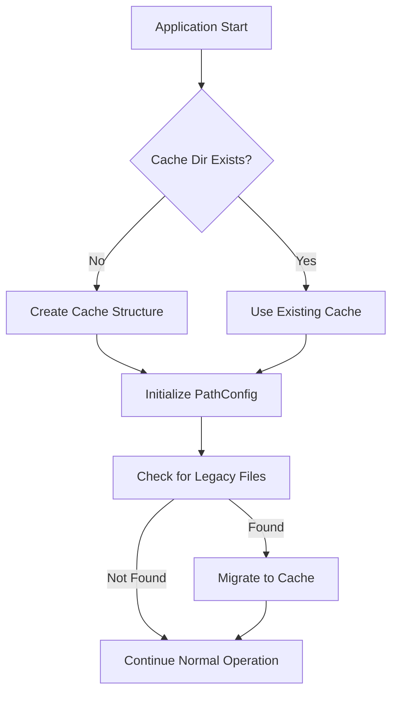
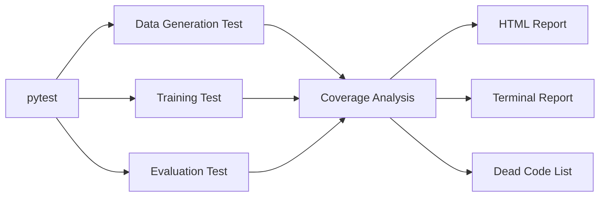
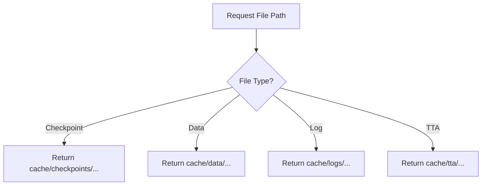

# Design Document

## Overview

This design implements a centralized cache directory structure for the NSA project and creates integration tests with coverage analysis to identify dead code after the PyTorch to JAX/Flax migration. The solution maintains backward compatibility while establishing a cleaner organization pattern for future development.

## Architecture

### Cache Directory Structure

```
cache/
├── checkpoints/
│   └── small_transformer_based/
│       └── results/
│           └── {model_size}M/
│               ├── checkpoint_epoch{N}_final.msgpack
│               └── emergency_epoch{N}_batch{M}.msgpack
├── data/
│   ├── full_trans.json
│   ├── vocab.json
│   ├── dataset_cache.txt
│   ├── training_data_summary.json
│   ├── arga_evaluation_tta.json
│   ├── arga_training_tta_epoch{N}.json
│   ├── arga_training_no_tta.json
│   ├── arga_evaluation_no_tta.json
│   └── proposed_transformations.txt
├── logs/
│   └── training_test.log
└── tta/
    └── {task_id}/
        ├── {task_id}.json
        └── generated_samples/
```

### Test Directory Structure

```
tests/
├── __init__.py
├── conftest.py                    # Shared fixtures and configuration
├── test_integration_data.py       # Data generation integration test
├── test_integration_train.py      # Training integration test
└── test_integration_eval.py       # Evaluation integration test
```

## Components and Interfaces

### 1. Path Configuration Module

**File:** `utils.py` (extend existing file)

**Purpose:** Centralize all path management for cache directory

**Interface:**
```python
class PathConfig:
    """Centralized path configuration for cache directory."""
    
    # Base directories
    CACHE_ROOT = "cache"
    CHECKPOINTS_DIR = "cache/checkpoints"
    DATA_DIR = "cache/data"
    LOGS_DIR = "cache/logs"
    TTA_DIR = "cache/tta"
    
    @staticmethod
    def ensure_cache_dirs() -> None:
        """Create cache directory structure if it doesn't exist."""
        
    @staticmethod
    def get_checkpoint_dir(model_size: str) -> str:
        """Get checkpoint directory path for a given model size."""
        
    @staticmethod
    def get_checkpoint_path(model_size: str, epoch: int, final: bool = True) -> str:
        """Get full checkpoint file path."""
        
    @staticmethod
    def get_data_path(filename: str) -> str:
        """Get data file path in cache/data/."""
        
    @staticmethod
    def get_log_path(filename: str) -> str:
        """Get log file path in cache/logs/."""
        
    @staticmethod
    def get_tta_dir(task_id: str) -> str:
        """Get TTA directory path for a specific task."""
```

### 2. File Migration Script

**File:** `scripts/migrate_to_cache.py` (new file)

**Purpose:** One-time migration of existing files to cache structure

**Functionality:**
- Scan for existing output files in legacy locations
- Move files to appropriate cache subdirectories
- Create symlinks for critical files (optional, for transition period)
- Generate migration report

### 3. Updated Training Module

**File:** `small_transformer_based/flax_train.py` (modifications)

**Changes:**
- Import PathConfig
- Replace hardcoded paths with PathConfig methods
- Update checkpoint saving to use cache directory
- Update vocab and data cache paths

**Key modifications:**
```python
# Before
plot_dir = f"small_transformer_based/results/{total_params_millions:.1f}M"
tokenizer.save_vocab("vocab.json")
with open("dataset_cache.txt", "w") as f:

# After
plot_dir = PathConfig.get_checkpoint_dir(f"{total_params_millions:.1f}M")
tokenizer.save_vocab(PathConfig.get_data_path("vocab.json"))
with open(PathConfig.get_data_path("dataset_cache.txt"), "w") as f:
```

### 4. Updated Evaluation Module

**File:** `small_transformer_based/flax_eval.py` (modifications)

**Changes:**
- Import PathConfig
- Update checkpoint loading paths
- Update results file paths
- Update TTA directory paths

### 5. Updated Data Generation Module

**File:** `auxilaries/generate_transformation.py` (modifications)

**Changes:**
- Update output paths for generated data
- Use cache directory for transformation JSON files

### 6. Integration Test Suite

**File:** `tests/conftest.py`

**Purpose:** Shared test fixtures and configuration

```python
import pytest
import os
import shutil
from pathlib import Path

@pytest.fixture(scope="session")
def test_cache_dir(tmp_path_factory):
    """Create temporary cache directory for tests."""
    cache_dir = tmp_path_factory.mktemp("test_cache")
    return cache_dir

@pytest.fixture(scope="session")
def test_data_dir(tmp_path_factory):
    """Create temporary data directory for tests."""
    data_dir = tmp_path_factory.mktemp("test_data")
    return data_dir

@pytest.fixture(autouse=True)
def setup_test_environment(monkeypatch, test_cache_dir):
    """Configure environment for tests."""
    monkeypatch.setenv("NSA_CACHE_DIR", str(test_cache_dir))
    yield
    # Cleanup after test
```

**File:** `tests/test_integration_data.py`

**Purpose:** Test data generation workflow

```python
def test_data_generation_minimal():
    """Test minimal data generation workflow."""
    # Generate 10 samples with 1-step transformations
    # Verify output files are created in cache
    # Verify JSON structure is valid
    # Verify samples contain expected fields
```

**File:** `tests/test_integration_train.py`

**Purpose:** Test training workflow

```python
def test_training_minimal():
    """Test minimal training workflow."""
    # Generate minimal dataset (10 samples)
    # Train for 1 epoch with batch_size=2
    # Verify checkpoint is saved to cache
    # Verify vocab file is created
    # Verify no crashes or errors
```

**File:** `tests/test_integration_eval.py`

**Purpose:** Test evaluation workflow

```python
def test_evaluation_minimal():
    """Test minimal evaluation workflow."""
    # Load pre-trained checkpoint (or train minimal model)
    # Evaluate on 2 tasks
    # Verify results file is created
    # Verify predictions are generated
```

### 7. Makefile Updates

**Changes to Makefile:**

```makefile
# Add test targets
test:
	@echo "Running full test suite with coverage..."
	uv run pytest tests/ --cov=. --cov-report=html --cov-report=term

test-quick:
	@echo "Running quick integration tests..."
	uv run pytest tests/ -v -k "minimal"

coverage:
	@echo "Generating coverage report..."
	uv run pytest tests/ --cov=. --cov-report=html --cov-report=term-missing
	@echo "Coverage report generated in htmlcov/"

coverage-html:
	@echo "Opening coverage report in browser..."
	$(MAKE) coverage
	open htmlcov/index.html || xdg-open htmlcov/index.html

# Update clean target
clean:
	@echo "Cleaning cache and generated files..."
	rm -rf cache/data/*.json cache/data/*.txt
	rm -rf cache/tta/
	rm -rf __pycache__/ */__pycache__/ */*/__pycache__/
	rm -rf htmlcov/ .coverage .pytest_cache/
	@echo "Cleanup complete."

clean-all: clean
	@echo "Removing virtual environment and all cache..."
	rm -rf .venv/
	rm -rf cache/
	@echo "Full cleanup complete."
```

## Data Models

### PathConfig State

```python
{
    "cache_root": "cache",
    "initialized": bool,
    "legacy_files_migrated": bool,
    "checkpoint_dirs": List[str],
    "data_files": List[str]
}
```

### Migration Report

```python
{
    "timestamp": str,
    "files_moved": [
        {
            "source": str,
            "destination": str,
            "size_bytes": int,
            "success": bool
        }
    ],
    "errors": List[str],
    "summary": {
        "total_files": int,
        "successful": int,
        "failed": int,
        "total_size_mb": float
    }
}
```

### Coverage Report Structure

```python
{
    "total_coverage": float,  # Percentage
    "modules": [
        {
            "name": str,
            "path": str,
            "coverage": float,
            "lines_total": int,
            "lines_covered": int,
            "lines_missing": List[int]
        }
    ],
    "dead_code_candidates": [
        {
            "file": str,
            "reason": str,  # "zero_coverage", "pytorch_residue", "unused_import"
            "lines": List[int]
        }
    ]
}
```

## Error Handling

### File Migration Errors

1. **File Not Found**: Log warning, continue with other files
2. **Permission Denied**: Log error, skip file, report in summary
3. **Disk Space**: Check available space before migration, abort if insufficient
4. **Duplicate Files**: Compare checksums, keep newer version

### Path Resolution Errors

1. **File Not Found**: Raise FileNotFoundError with clear message about expected cache location
2. **Cache Directory Creation Failed**: Raise OSError with permission details
3. **Invalid Path Format**: Raise ValueError with descriptive message

### Test Execution Errors

1. **Data Generation Timeout**: Fail test with clear message about timeout settings
2. **Training OOM**: Reduce batch size automatically, retry once
3. **Checkpoint Load Failure**: Skip test if no checkpoint available, mark as skipped not failed

## Testing Strategy

### Unit Tests (Future Work)

- PathConfig methods
- File migration logic
- Path resolution with fallbacks

### Integration Tests (This Spec)

1. **Data Generation Test**
   - Duration: ~30 seconds
   - Generates 10 samples
   - Verifies file creation and structure

2. **Training Test**
   - Duration: ~2 minutes
   - Trains for 1 epoch on 10 samples
   - Verifies checkpoint and vocab creation

3. **Evaluation Test**
   - Duration: ~1 minute
   - Evaluates 2 tasks
   - Verifies results file creation

### Coverage Analysis

**Configuration:** `.coveragerc`
```ini
[run]
source = .
omit =
    */tests/*
    */test_*
    */__pycache__/*
    */.venv/*
    */small_transformer_based/train.py
    setup.py

[report]
exclude_lines =
    pragma: no cover
    def __repr__
    raise AssertionError
    raise NotImplementedError
    if __name__ == .__main__.:
    if TYPE_CHECKING:
```

**Target Coverage:**
- Core modules (ARCGraph, task, utils): 60%+
- Training/eval modules: 40%+ (integration coverage)
- Transformation modules: 30%+ (many edge cases)

**Dead Code Identification Process:**
1. Run coverage with integration tests
2. Identify files with 0% coverage
3. Check if file is PyTorch-related (imports torch)
4. Verify file is not imported anywhere
5. Mark as dead code candidate
6. Manual review before deletion

## Implementation Notes

### Performance Considerations

1. **File Migration**: Run once as a script, not on every execution
2. **Path Resolution**: Simple string concatenation, no filesystem checks needed
3. **Test Execution**: Run in parallel where possible (pytest-xdist future enhancement)

### Apple Silicon Optimizations

- Tests use same JAX/Metal optimizations as main code
- Batch sizes adjusted for unified memory
- JIT compilation benefits apply to test execution

## Diagrams

### Cache Directory Flow



### Test Execution Flow



### Path Resolution Logic



## Security Considerations

1. **File Permissions**: Ensure cache directory has appropriate permissions (0755)
2. **Path Traversal**: Validate all path inputs to prevent directory traversal attacks
3. **Symlink Safety**: If using symlinks, verify targets are within project directory
4. **Temporary Files**: Clean up test temporary files after execution

## Migration Checklist

- [ ] Create PathConfig class in utils.py
- [ ] Create migration script
- [ ] Update flax_train.py paths
- [ ] Update flax_eval.py paths
- [ ] Update generate_transformation.py paths
- [ ] Create test directory structure
- [ ] Implement integration tests
- [ ] Configure pytest-cov
- [ ] Update Makefile
- [ ] Run migration script
- [ ] Verify all tests pass
- [ ] Generate coverage report
- [ ] Identify dead code
- [ ] Update documentation
