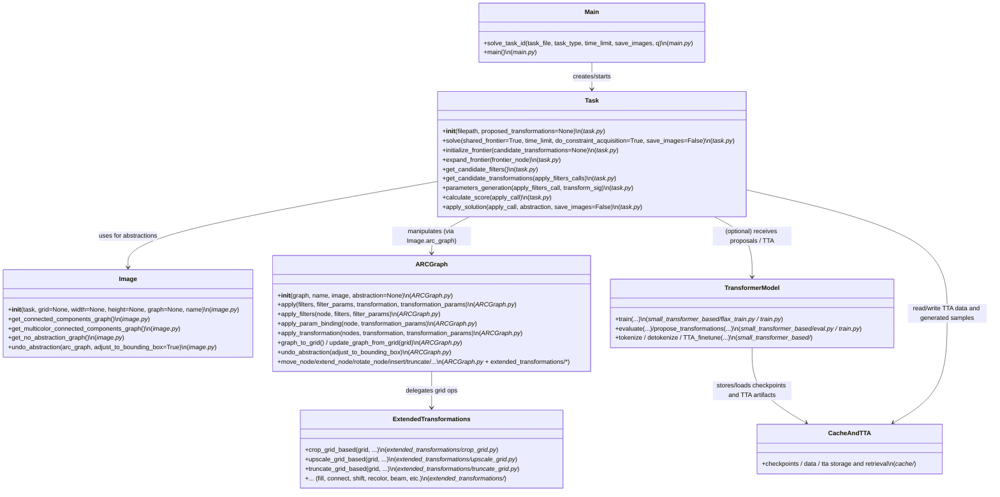
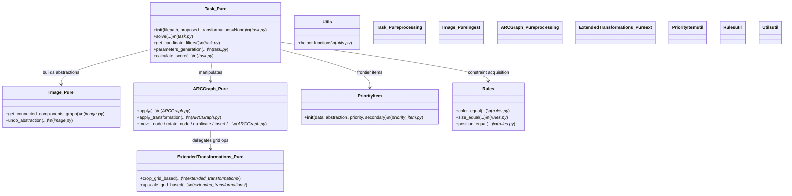
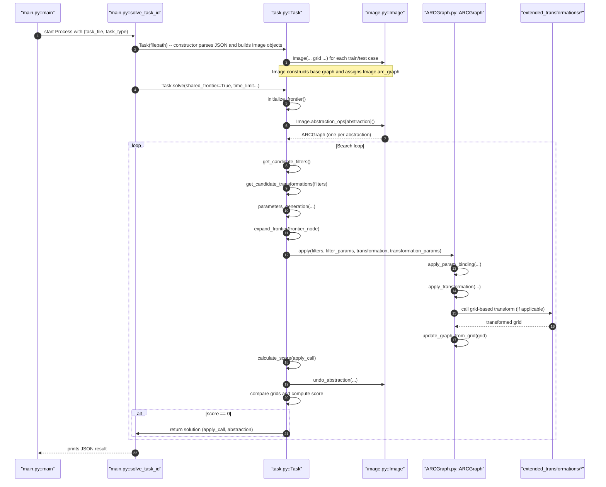
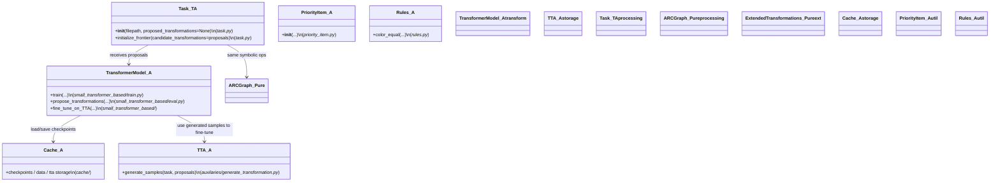
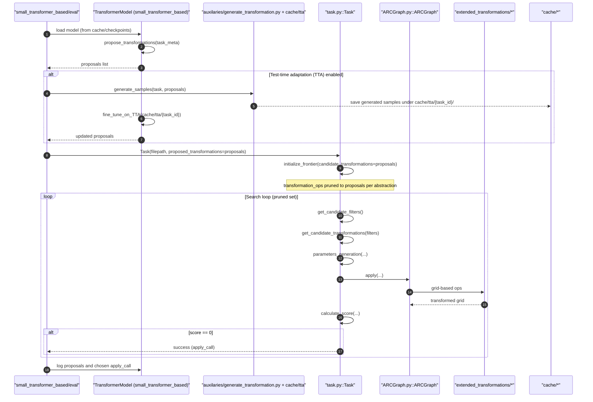

# ARC Agent — Detailed UML (Two Operation Modes)

This document contains detailed Mermaid UML diagrams that show the Final ARC agent's two operation modes: (A) Pure symbolic search and (B) Transformer‑assisted (with optional Test‑Time Adaptation). Each diagram lists the primary files and the core functions called during the flows so you can quickly map code → runtime.

---

## Class-level overview



---

## No-transformer path — Class-level overview (pure symbolic search)



## No-transformer path — Sequence (pure symbolic search)



---

## Transformer-assisted path — Class-level overview (transformer + TTA)



## Transformer-assisted path — Sequence (proposals + optional TTA)



---

Minimal legend: nodes show primary file and key functions; arrows show call/flow direction. Use these diagrams to jump to the exact function in the codebase (file names are inline with methods).


(End of diagrams)
```
