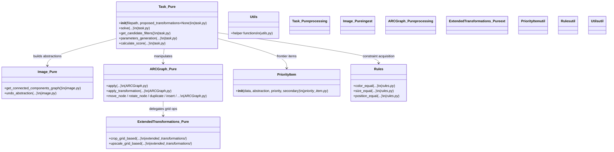
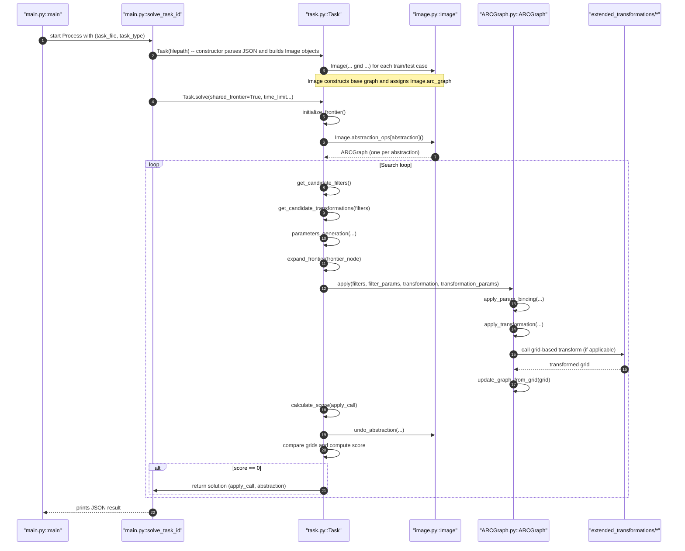

# ARC Agent — No-transformer mode (Pure symbolic search)

This document contains the Mermaid UML diagrams for the Final ARC agent's No-transformer (pure symbolic search) operation mode. It includes the focused class-level overview and the sequence diagram that shows runtime flow for solving a task using pure symbolic search (no ML proposals / TTA).

---

## No-transformer path — Class-level overview (pure symbolic search)

### Referenced Python files (relative paths)

- [`main.py`](../main.py)
- [`task.py`](../task.py)
- [`image.py`](../image.py)
- [`ARCGraph.py`](../ARCGraph.py)
- [`priority_item.py`](../priority_item.py)
- [`rules.py`](../rules.py)
- [`utils.py`](../utils.py)
- [`extended_transformations/arbitrary_duplicate_grid.py`](../extended_transformations/arbitrary_duplicate_grid.py)
- [`extended_transformations/beam_grid.py`](../extended_transformations/beam_grid.py)
- [`extended_transformations/connect_grid.py`](../extended_transformations/connect_grid.py)
- [`extended_transformations/crop_grid.py`](../extended_transformations/crop_grid.py)
- [`extended_transformations/fill_grid.py`](../extended_transformations/fill_grid.py)
- [`extended_transformations/magnet_grid.py`](../extended_transformations/magnet_grid.py)
- [`extended_transformations/mirror_grid.py`](../extended_transformations/mirror_grid.py)
- [`extended_transformations/recolor_grid.py`](../extended_transformations/recolor_grid.py)
- [`extended_transformations/rotate_duplicate.py`](../extended_transformations/rotate_duplicate.py)
- [`extended_transformations/rotate_grid.py`](../extended_transformations/rotate_grid.py)
- [`extended_transformations/shift_grid.py`](../extended_transformations/shift_grid.py)
- [`extended_transformations/truncate_grid.py`](../extended_transformations/truncate_grid.py)
- [`extended_transformations/upscale_grid.py`](../extended_transformations/upscale_grid.py)
- [`extended_transformations/utils.py`](../extended_transformations/utils.py)

## No-transformer path — Sequence (pure symbolic search)

---

Minimal legend: nodes show primary file and key functions; arrows show call/flow direction. Use these diagrams to jump to the exact function in the codebase (file names are inline with methods).

(End of No-transformer diagrams)
