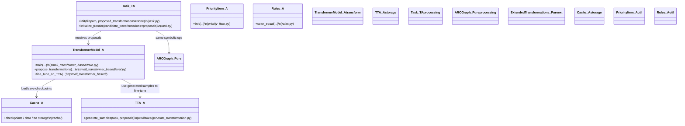
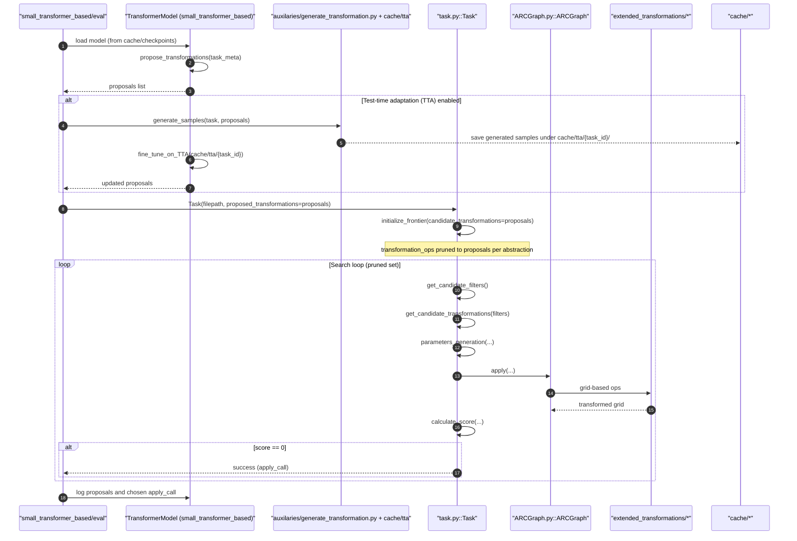

# ARC Agent — Transformer-assisted mode (Transformer + TTA)

This document contains the Mermaid UML diagrams for the Final ARC agent's Transformer‑assisted operation mode. It includes the focused class-level overview and the sequence diagram that shows runtime flow for using ML proposals and optional Test‑Time Adaptation (TTA) together with the symbolic search.

---

## Transformer-assisted path — Class-level overview (transformer + TTA)

### Referenced Python files (relative paths)

- [`small_transformer_based/train.py`](../small_transformer_based/train.py)
- [`small_transformer_based/eval.py`](../small_transformer_based/eval.py)
- [`small_transformer_based/flax_train.py`](../small_transformer_based/flax_train.py)
- [`small_transformer_based/flax_eval.py`](../small_transformer_based/flax_eval.py)
- [`small_transformer_based/flax_model.py`](../small_transformer_based/flax_model.py)
- [`auxilaries/generate_transformation.py`](../auxilaries/generate_transformation.py)
- [`main.py`](../main.py)
- [`task.py`](../task.py)
- [`ARCGraph.py`](../ARCGraph.py)
- [`priority_item.py`](../priority_item.py)
- [`rules.py`](../rules.py)
- [`utils.py`](../utils.py)
- [`extended_transformations/arbitrary_duplicate_grid.py`](../extended_transformations/arbitrary_duplicate_grid.py)
- [`extended_transformations/beam_grid.py`](../extended_transformations/beam_grid.py)
- [`extended_transformations/connect_grid.py`](../extended_transformations/connect_grid.py)
- [`extended_transformations/crop_grid.py`](../extended_transformations/crop_grid.py)
- [`extended_transformations/fill_grid.py`](../extended_transformations/fill_grid.py)
- [`extended_transformations/magnet_grid.py`](../extended_transformations/magnet_grid.py)
- [`extended_transformations/mirror_grid.py`](../extended_transformations/mirror_grid.py)
- [`extended_transformations/recolor_grid.py`](../extended_transformations/recolor_grid.py)
- [`extended_transformations/rotate_duplicate.py`](../extended_transformations/rotate_duplicate.py)
- [`extended_transformations/rotate_grid.py`](../extended_transformations/rotate_grid.py)
- [`extended_transformations/shift_grid.py`](../extended_transformations/shift_grid.py)
- [`extended_transformations/truncate_grid.py`](../extended_transformations/truncate_grid.py)
- [`extended_transformations/upscale_grid.py`](../extended_transformations/upscale_grid.py)
- [`extended_transformations/utils.py`](../extended_transformations/utils.py)

## Transformer-assisted path — Sequence (proposals + optional TTA)

---

Minimal legend: nodes show primary file and key functions; arrows show call/flow direction. Use these diagrams to jump to the exact function in the codebase (file names are inline with methods).

(End of Transformer-assisted diagrams)
