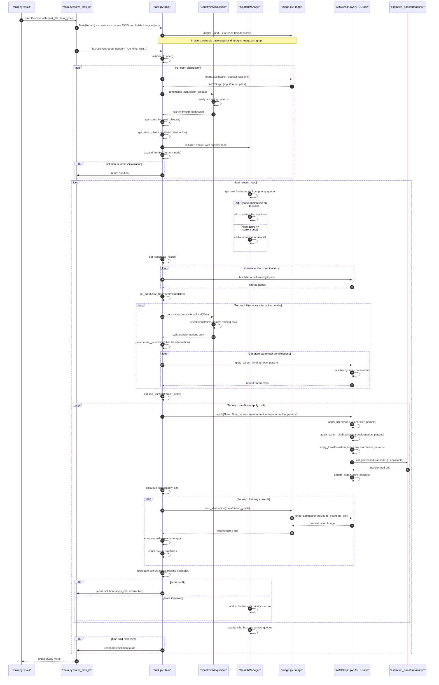

# ARC Agent — No-transformer mode (Pure symbolic search)

This document contains the Mermaid UML diagrams for the Final ARC agent's No-transformer (pure symbolic search) operation mode. It includes the focused class-level overview and the sequence diagram that shows runtime flow for solving a task using pure symbolic search (no ML proposals / TTA).

---

## No-transformer path — Class-level overview (pure symbolic search)

```mermaid
classDiagram
    %% Focused classes for pure symbolic search
    classDef ingest fill:#E3F2FD,stroke:#1E88E5,stroke-width:1px;
    classDef processing fill:#FFF3E0,stroke:#FB8C00,stroke-width:1px;
    classDef ext fill:#FFEBEE,stroke:#E53935,stroke-width:1px;
    classDef util fill:#E0F7FA,stroke:#006064,stroke-width:1px;
    classDef search fill:#F3E5F5,stroke:#8E24AA,stroke-width:1px;

    class Task_Pure {
        +__init__(filepath, proposed_transformations=None)\n(*task.py*)
        +solve(...)\n(*task.py*)
        +initialize_frontier()\n(*task.py*)
        +search_shared_frontier()\n(*task.py*)
        +expand_frontier(frontier_node)\n(*task.py*)
        +get_candidate_filters()\n(*task.py*)
        +get_candidate_transformations(filters)\n(*task.py*)
        +parameters_generation(...)\n(*task.py*)
        +calculate_score(apply_call)\n(*task.py*)
        +get_static_inserted_objects()\n(*task.py*)
        +get_static_object_attributes(abstraction)\n(*task.py*)
    }

    class ConstraintAcquisition {
        +constraints_acquisition_global()\n(*task.py*)
        +constraints_acquisition_local(apply_filter_call)\n(*task.py*)
        +apply_constraint(rule, apply_filter_call)\n(*task.py*)
        +prune_transformations(constraints)\n(*task.py*)
        +constraints_param_generation(...)\n(*task.py*)
    }

    class SearchManager {
        +frontier: PriorityQueue\n(*task.py*)
        +tabu_list: dict\n(*task.py*)
        +frontier_hash: dict\n(*task.py*)
        +current_best_scores: dict\n(*task.py*)
    }

    class Image_Pure {
        +get_connected_components_graph()\n(*image.py*)
        +get_non_black_components_graph()\n(*image.py*)
        +get_multicolor_connected_components_graph()\n(*image.py*)
        +get_no_abstraction_graph()\n(*image.py*)
        +undo_abstraction(arc_graph, adjust_to_bounding_box)\n(*image.py*)
    }

    class ARCGraph_Pure {
        +apply(filters, filter_params, transformation, transformation_params)\n(*ARCGraph.py*)
        +apply_filters(node, filters, filter_params)\n(*ARCGraph.py*)
        +apply_param_binding(node, transformation_params)\n(*ARCGraph.py*)
        +apply_transformation(nodes, transformation, transformation_params)\n(*ARCGraph.py*)
        +filter_by_color / filter_by_size / filter_by_degree\n(*ARCGraph.py*)
        +param_bind_neighbor_by_color / param_bind_neighbor_by_size\n(*ARCGraph.py*)
        +undo_abstraction(adjust_to_bounding_box)\n(*ARCGraph.py*)
        +move_node / rotate_node / duplicate / insert / ...\n(*ARCGraph.py*)
    }

    class ExtendedTransformations_Pure {
        +crop_grid_based(...)\n(*extended_transformations/*)
        +upscale_grid_based(...)\n(*extended_transformations/*)
        +magnet_grid_based(...)\n(*extended_transformations/*)
        +beam_grid_based(...)\n(*extended_transformations/*)
    }

    class PriorityItem {
        +__init__(data, abstraction, priority, secondary)\n(*priority_item.py*)
    }

    class Rules {
        +color_equal(input_seq, output_seq)\n(*rules.py*)
        +size_equal(input_seq, output_seq)\n(*rules.py*)
        +position_equal(input_seq, output_seq)\n(*rules.py*)
        +list_of_rules: list\n(*rules.py*)
    }

    class Utils {
        +helper functions\n(*utils.py*)
    }

    class Task_Pure processing
    class ConstraintAcquisition search
    class SearchManager search
    class Image_Pure ingest
    class ARCGraph_Pure processing
    class ExtendedTransformations_Pure ext
    class PriorityItem util
    class Rules util
    class Utils util

    Task_Pure --> Image_Pure : builds abstractions
    Task_Pure --> ARCGraph_Pure : manipulates
    Task_Pure --> ConstraintAcquisition : prunes search space
    Task_Pure --> SearchManager : manages frontier & tabu
    ARCGraph_Pure --> ExtendedTransformations_Pure : delegates grid ops
    ConstraintAcquisition --> Rules : applies constraints
    SearchManager --> PriorityItem : frontier items

```

### Key Methods by Component

**Task (task.py):**
- `solve()`, `initialize_frontier()`, `search_shared_frontier()`, `expand_frontier()`
- `get_candidate_filters()`, `get_candidate_transformations()`, `parameters_generation()`
- `calculate_score()`, `get_static_inserted_objects()`, `get_static_object_attributes()`
- `constraints_acquisition_global()`, `constraints_acquisition_local()`, `prune_transformations()`

**ARCGraph (ARCGraph.py):**
- `apply()`, `apply_filters()`, `apply_param_binding()`, `apply_transformation()`
- `filter_by_color()`, `filter_by_size()`, `filter_by_degree()`, `filter_by_neighbor_**()`
- `param_bind_neighbor_by_color()`, `param_bind_neighbor_by_size()`, `param_bind_node_by_shape()`
- `undo_abstraction()`, `undo_abstraction1()`, `undo_abstraction2()`
- Transformations: `move_node()`, `rotate_node()`, `extract()`, `duplicate()`, `insert()`, etc.

**Image (image.py):**
- Abstractions: `get_connected_components_graph()`, `get_non_black_components_graph()`
- `get_multicolor_connected_components_graph()`, `get_no_abstraction_graph()`
- `undo_abstraction()`

**Rules (rules.py):**
- `color_equal()`, `size_equal()`, `position_equal()`, `list_of_rules`

### Referenced Files
[`main.py`](../main.py) | [`task.py`](../task.py) | [`image.py`](../image.py) | [`ARCGraph.py`](../ARCGraph.py) | [`priority_item.py`](../priority_item.py) | [`rules.py`](../rules.py) | [`utils.py`](../utils.py) | [`extended_transformations/*`](../extended_transformations/)

## No-transformer path — Sequence (pure symbolic search)

---

**Legend:** Class nodes show primary file and key methods; sequence arrows show call/flow direction with critical phases: initialization (constraint acquisition, static object detection), search (filter generation, parameter binding, transformation application), and evaluation (scoring, grid reconstruction).

(End of No-transformer diagrams)
