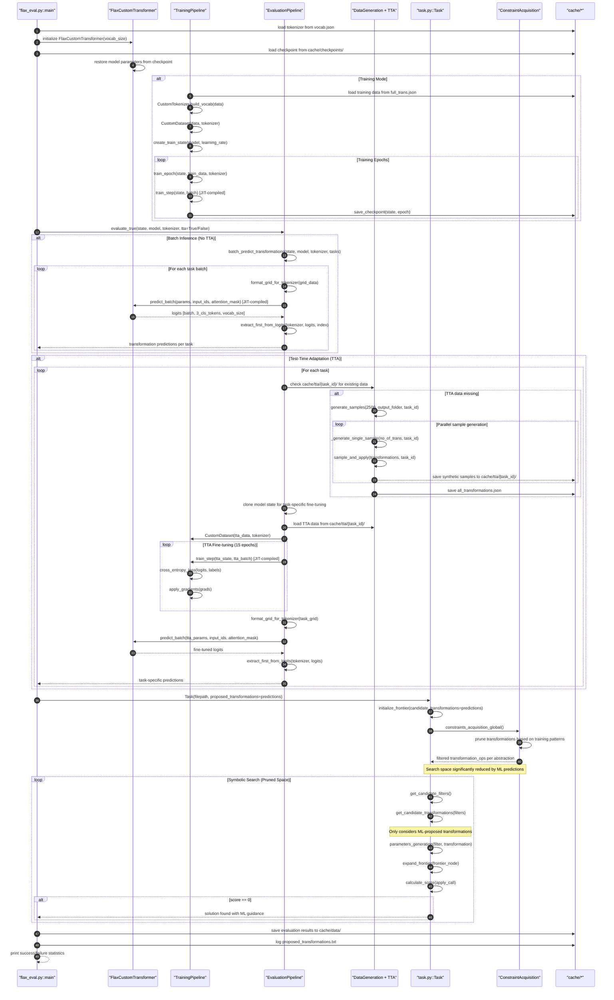

# ARC Agent — Transformer-assisted mode (Transformer + TTA)

This document contains the Mermaid UML diagrams for the Final ARC agent's Transformer‑assisted operation mode. It includes the focused class-level overview and the sequence diagram that shows runtime flow for using ML proposals and optional Test‑Time Adaptation (TTA) together with the symbolic search.

---

## Transformer-assisted path — Class-level overview (transformer + TTA)

```mermaid
classDiagram
    %% Focused classes for transformer-assisted flow
    classDef transform fill:#E8F5E9,stroke:#43A047,stroke-width:1px;
    classDef storage fill:#F3E5F5,stroke:#8E24AA,stroke-width:1px;
    classDef processing fill:#FFF3E0,stroke:#FB8C00,stroke-width:1px;
    classDef training fill:#E3F2FD,stroke:#1E88E5,stroke-width:1px;
    classDef evaluation fill:#FFF8E1,stroke:#FFA000,stroke-width:1px;

    class ModelArchitecture {
        +FlaxCustomTransformer(vocab_size, n_embd=512, n_layer=8)\n(*flax_model.py*)
        +SinusoidalPositionalEncoding(n_embd, max_len=6500)\n(*flax_model.py*)
        +FlaxTransformerEncoder(n_embd, n_head=8)\n(*flax_model.py*)
        +__call__(input_ids, attention_mask, deterministic)\n(*flax_model.py*)
        +count_parameters(params)\n(*flax_model.py*)
    }

    class TrainingPipeline {
        +CustomTokenizer(special_tokens, transformations)\n(*flax_train.py*)
        +CustomDataset(data, tokenizer, max_length)\n(*flax_train.py*)
        +create_train_state(rng, model, learning_rate)\n(*flax_train.py*)
        +train_step(state, batch, padding_idx)\n(*flax_train.py*)
        +train_epoch(state, train_data, tokenizer)\n(*flax_train.py*)
        +save_checkpoint(state, path, epoch)\n(*flax_train.py*)
        +balance_transformations(data)\n(*flax_train.py*)
    }

    class EvaluationPipeline {
        +create_predict_fn(model)\n(*flax_eval.py*)
        +batch_predict_transformations(state, model, tokenizer)\n(*flax_eval.py*)
        +evaluate_with_tta(state, model, tokenizer, task_id)\n(*flax_eval.py*)
        +extract_first_from_logits(tokenizer, logits, index)\n(*flax_eval.py*)
        +format_grid_for_tokenizer(grid_data)\n(*flax_eval.py*)
        +evaluate_true(state, model, tokenizer, tta)\n(*flax_eval.py*)
    }

    class DataGeneration {
        +generate_samples(number_of_samples, output_folder)\n(*generate_transformation.py*)
        +_generate_single_sample(args)\n(*generate_transformation.py*)
        +sample_and_apply(no_of_trans, transformation_ops)\n(*grid_transformation.py*)
        +prepare_and_save_transformed_data(...)\n(*grid_transformation.py*)
    }

    class Task_TA {
        +__init__(filepath, proposed_transformations=None)\n(*task.py*)
        +solve(shared_frontier=True, time_limit=1800)\n(*task.py*)
        +initialize_frontier(candidate_transformations=proposals)\n(*task.py*)
        +get_candidate_transformations(filters)\n(*task.py*)
        +expand_frontier(frontier_node)\n(*task.py*)
    }

    class ConstraintAcquisition_TA {
        +constraints_acquisition_global()\n(*task.py*)
        +constraints_acquisition_local(apply_filter_call)\n(*task.py*)
        +prune_transformations(constraints)\n(*task.py*)
    }

    class Cache_A {
        +checkpoints/: model checkpoints\n(*cache/checkpoints/*)
        +data/: vocab.json, full_trans.json\n(*cache/data/*)
        +tta/: task-specific synthetic data\n(*cache/tta/*)
        +logs/: training logs\n(*cache/logs/*)
    }

    class Utils_A {
        +PathConfig.get_checkpoint_dir()\n(*utils.py*)
        +PathConfig.get_tta_dir(task_id)\n(*utils.py*)
        +return_task_grid(task_file)\n(*plots.py*)
    }

    class ModelArchitecture transform
    class TrainingPipeline training
    class EvaluationPipeline evaluation
    class DataGeneration storage
    class Task_TA processing
    class ConstraintAcquisition_TA processing
    class Cache_A storage
    class Utils_A util

    TrainingPipeline --> ModelArchitecture : trains model
    TrainingPipeline --> Cache_A : saves checkpoints & vocab
    EvaluationPipeline --> ModelArchitecture : loads & runs inference
    EvaluationPipeline --> Cache_A : loads checkpoints
    EvaluationPipeline --> DataGeneration : triggers TTA data generation
    DataGeneration --> Cache_A : saves TTA samples
    Task_TA --> EvaluationPipeline : receives proposals
    Task_TA --> ConstraintAcquisition_TA : prunes search with proposals
    Utils_A --> Cache_A : manages paths & data access

```

### Key Methods by Component

**ModelArchitecture (flax_model.py):**
- `FlaxCustomTransformer.__call__()`, `SinusoidalPositionalEncoding.__call__()`
- `FlaxTransformerEncoder.__call__()`, `count_parameters()`

**TrainingPipeline (flax_train.py):**
- `CustomTokenizer`: `build_vocab()`, `tokenize()`, `encode()`, `decode()`
- `CustomDataset.__getitem__()`, `create_train_state()`, `train_step()` (JIT-compiled)
- `train_epoch()`, `save_checkpoint()`, `load_checkpoint()`, `balance_transformations()`

**EvaluationPipeline (flax_eval.py):**
- `create_predict_fn()` (JIT-compiled), `batch_predict_transformations()`
- `evaluate_with_tta()`, `extract_first_from_logits()`, `format_grid_for_tokenizer()`
- `evaluate_true()`, `_solve_single_task()` (parallel worker)

**DataGeneration (generate_transformation.py):**
- `generate_samples()`, `_generate_single_sample()` (parallel worker)
- `sample_and_apply()`, `prepare_and_save_transformed_data()`

**Task Integration (task.py):**
- `Task.__init__(proposed_transformations)`, `initialize_frontier(candidate_transformations)`
- `get_candidate_transformations()` (filtered by proposals)

**Cache Management (utils.py):**
- `PathConfig.get_checkpoint_dir()`, `PathConfig.get_tta_dir()`, `PathConfig.get_data_path()`

### Referenced Files
[`flax_model.py`](../small_transformer_based/flax_model.py) | [`flax_train.py`](../small_transformer_based/flax_train.py) | [`flax_eval.py`](../small_transformer_based/flax_eval.py) | [`generate_transformation.py`](../auxilaries/generate_transformation.py) | [`task.py`](../task.py) | [`utils.py`](../utils.py) | [`plots.py`](../plots.py)

## Transformer-assisted path — Sequence (proposals + optional TTA)

---

**Legend:** Class nodes show primary file and key methods; sequence arrows show complete ML pipeline flow including training (tokenization, dataset creation, JAX/Flax training loop), evaluation (batch inference, TTA fine-tuning), data generation (parallel synthetic sample creation), and integration (ML predictions guide symbolic search space pruning).

(End of Transformer-assisted diagrams)
