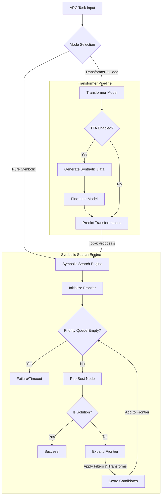

# Deep Dive: NSA Agent Architecture & Mechanisms

This document provides a comprehensive technical analysis of how the NSA (Neuro-Symbolic ARC) agent works, covering:
1. **Pure Symbolic Search** (no transformer)
2. **Transformer-Guided Search** (with optional TTA)
3. **Transformer Training Process**

---

## Architecture Overview



---

## Part 1: Pure Symbolic Search

### Overview

The agent uses **best-first search** through a space of grid transformations. The core idea is:
1. Start with input grids abstracted as graphs
2. Generate candidate filters to select nodes
3. Generate candidate transformations to apply
4. Score each transformation by comparing against training outputs
5. Explore the most promising transformations first (priority queue)

### 1.1 Frontier Initialization

**Entry Point**: `Task.initialize_frontier()`

```python
# For each abstraction type (e.g., connected components, multicolor)
for abstraction in all_possible_abstractions:
    # Build graph representation
    input_abstracted_graphs = [
        getattr(input, Image.abstraction_ops[abstraction])() 
        for input in train_input
    ]
    
    # Extract object properties for parameter generation
    self.get_static_object_attributes(abstraction)
    
    # Perform constraint acquisition (prune impossible transformations)
    if do_constraint_acquisition:
        self.constraints_acquisition_global()
    
    # Start with identity transformation (do nothing)
    frontier_node = PriorityItem([], abstraction, float("inf"), float("inf"))
    self.expand_frontier(frontier_node)
```

**Key Data Structures**:
- `frontier`: Priority queue of `PriorityItem(apply_calls, abstraction, score, depth)`
- `abstraction`: How to represent the grid (connected components, multicolor, raw pixels, etc.)
- `apply_calls`: List of transformation dictionaries to apply sequentially

### 1.2 Search Loop

**Entry Point**: `Task.search_shared_frontier()`

The search loop runs until:
- Solution found (score = 0)
- Time limit exceeded
- Frontier exhausted

```python
while not stop_search:
    # Pop best node from priority queue
    frontier_node = self.frontier.get()
    
    # Check if solution found
    if frontier_node.priority == 0:
        return solution
    
    # Expand node (generate successors)
    self.expand_frontier(frontier_node)
    
    # Check time limit
    if time.time() - start_time > time_limit:
        return best_solution_so_far
```

**Priority Scoring**:
- **Primary**: Total pixel errors across all training examples
- **Secondary**: Number of transformations (prefer shorter solutions)

### 1.3 Frontier Expansion

**Entry Point**: `Task.expand_frontier(frontier_node)`

This is where the magic happens - generating all possible next transformations:

```python
def expand_frontier(self, frontier_node):
    # 1. Apply current transformation sequence to get updated graphs
    for input_abstracted_graph in input_abstracted_graphs_original:
        input_abstracted = input_abstracted_graph.copy()
        for apply_call in frontier_node.data:
            input_abstracted.apply(**apply_call)
    
    # 2. Generate candidate filters (which nodes to transform?)
    filters = self.get_candidate_filters()
    
    # 3. Generate candidate transformations (what to do to those nodes?)
    apply_calls = self.get_candidate_transformations(filters)
    
    # 4. Score each candidate
    for apply_call in apply_calls:
        cumulated_apply_calls = frontier_node.data + [apply_call]
        score = self.calculate_score(cumulated_apply_calls)
        
        if score >= 0:  # Valid transformation
            priority_item = PriorityItem(
                cumulated_apply_calls, abstraction, score, len(cumulated_apply_calls)
            )
            self.frontier.put(priority_item)
```

### 1.4 Filter Generation

**Entry Point**: `Task.get_candidate_filters()`

Filters select which nodes (objects) to transform. The agent generates **all combinations** of filter types and parameters:

```python
# Example filters:
# - filter_by_color(color=1, exclude=False)  # Select all blue nodes
# - filter_by_size(size="max", exclude=False)  # Select largest node
# - filter_by_degree(degree=4, exclude=True)  # Exclude nodes with 4 neighbors

for filter_op in ARCGraph.filter_ops:
    # Generate all parameter combinations
    for color in [0-9, "most", "least"]:
        for exclude in [True, False]:
            candidate_filter = {
                "filters": [filter_op],
                "filter_params": [{"color": color, "exclude": exclude}]
            }
            
            # Only keep filters that select nodes in ALL training examples
            if applicable_to_all_training_examples(candidate_filter):
                ret_apply_filter_calls.append(candidate_filter)

# Also generate TWO-filter combinations
for first_filter, second_filter in combinations(single_filters, 2):
    combined_filter = first_filter + second_filter
    if applicable_to_all(combined_filter):
        ret_apply_filter_calls.append(combined_filter)
```

**Deduplication**: Filters that select the same set of nodes are pruned.

### 1.5 Transformation Generation

**Entry Point**: `Task.get_candidate_transformations(apply_filters_calls)`

For each filter, generate all valid transformations:

```python
for apply_filters_call in filters:
    # Constraint acquisition: prune transformations that violate invariants
    if do_constraint_acquisition:
        constraints = self.constraints_acquisition_local(apply_filters_call)
        transformation_ops = self.prune_transformations(constraints)
    
    for transform_op in transformation_ops:
        # Generate all parameter combinations
        generated_params = self.parameters_generation(apply_filters_call, transform_op)
        
        for param_combination in product(*generated_params):
            apply_call = {
                "filters": filters,
                "filter_params": filter_params,
                "transformation": [transform_op],
                "transformation_params": [param_vals]
            }
            ret_apply_calls.append(apply_call)
```

**Example Transformations**:
- `move_node(direction=UP)` - Move node upward
- `update_color(color=3)` - Change color to yellow
- `rotate_node(rotation_dir=CW90)` - Rotate 90° clockwise
- `crop(corner="right upper", crop_type="corner_based")` - Crop grid
- `connect(connect_mode="connect_with_line", color=1)` - Connect objects

### 1.6 Parameter Generation

**Entry Point**: `Task.parameters_generation(apply_filters_call, transform_sig)`

This generates **all possible parameter values** for a transformation:

```python
def parameters_generation(self, apply_filters_call, transform_sig):
    generated_params = []
    
    for param in transform_sig.parameters:
        if param_name == "color":
            all_possible_values = [0-9, "most", "least"]
        elif param_name == "direction":
            all_possible_values = [UP, DOWN, LEFT, RIGHT]
        elif param_name == "rotation_dir":
            all_possible_values = [CW90, CW180, CW270]
        elif param_name == "size":
            # Use sizes observed in training data
            all_possible_values = object_sizes + ["min", "max", "odd"]
        # ... many more parameter types
        
        generated_params.append(all_possible_values)
    
    return generated_params  # Cartesian product generates all combinations
```

### 1.7 Scoring Mechanism

**Entry Point**: `Task.calculate_score(apply_call)`

Score = total pixel mismatches across all training examples:

```python
def calculate_score(self, apply_call):
    score = 0
    
    # Apply transformation sequence to each training input
    for i, input_abstracted_graph in enumerate(input_abstracted_graphs):
        for call in apply_call:
            input_abstracted_graph.apply(**call)
        
        # Undo abstraction to get final grid
        reconstructed = undo_abstraction(input_abstracted_graph)
        reconstructed_grid = graph_to_grid(reconstructed)
        expected_grid = train_output[i].grid
        
        # Check size match
        if reconstructed.shape != expected.shape:
            return -1, -1  # Invalid (size mismatch)
        
        # Count pixel differences
        for y in range(height):
            for x in range(width):
                if reconstructed_grid[y][x] != expected_grid[y][x]:
                    score += 1
    
    return score, grid_tuple
```

**Score Interpretation**:
- `score = 0`: Perfect match → **solution found!**
- `score > 0`: Partial match → continue search
- `score = -1`: Invalid transformation → discard

### 1.8 Constraint Acquisition

**Purpose**: Prune the search space by discovering invariants

**Global Constraints** (`constraints_acquisition_global()`):
- Rules that ALL nodes must follow across all training examples
- Example: "All red nodes must have exactly 4 neighbors"

**Local Constraints** (`constraints_acquisition_local(apply_filter_call)`):
- Rules specific to filtered nodes
- Example: "Nodes with size=max must have degree=4"

**Rules Tested**:
```python
rules = [
    "color_equal",      # All filtered nodes have same color
    "size_equal",       # All filtered nodes have same size
    "position_equal",   # All filtered nodes at same position
    "degree_equal",     # All filtered nodes have same degree
    # ... many more
]
```

If a rule holds for all training examples, the agent can:
1. Use it to generate better parameters
2. Prune transformations that would violate it

---

## Part 2: Transformer-Guided Search

### Overview

The transformer **doesn't solve tasks directly**. Instead, it:
1. Looks at training input-output pairs
2. Predicts which transformations are likely needed
3. The symbolic search explores ONLY those transformations

This dramatically reduces the search space (from ~100 transformations to ~5-10).

### 2.1 Model Architecture

**File**: `small_transformer_based/flax_model.py`

**Key Innovation**: 3 classification tokens

```python
class FlaxCustomTransformer:
    vocab_size: int      # ~60 tokens (transformations + special tokens)
    n_embd: int = 512    # Embedding dimension
    n_layer: int = 8     # Transformer layers
    n_head: int = 8      # Attention heads
    num_cls_tokens: int = 3  # Predict up to 3 transformations
    
    def __call__(self, input_ids):
        # 1. Embed input tokens (grid representation)
        x = Embed(input_ids)  # [batch, seq_len, 512]
        
        # 2. Add sinusoidal positional encoding
        x = SinusoidalPositionalEncoding()(x)
        
        # 3. Prepend 3 learnable [CLS] tokens
        cls_tokens = self.param("cls_tokens", ...)  # [1, 3, 512]
        x = concatenate([cls_tokens, x], axis=1)  # [batch, 3+seq_len, 512]
        
        # 4. Pass through 8 transformer layers
        for _ in range(8):
            x = TransformerEncoder()(x)
        
        # 5. Extract [CLS] outputs
        cls_outputs = x[:, :3, :]  # [batch, 3, 512]
        
        # 6. Project to vocabulary (transformation names)
        logits = Dense(vocab_size)(cls_outputs)  # [batch, 3, vocab_size]
        
        return logits
```

**Total Parameters**: ~25.3M

**Output Interpretation**:
- `logits[0]`: Probability distribution over transformations for slot 1
- `logits[1]`: Probability distribution for slot 2
- `logits[2]`: Probability distribution for slot 3
- Special token `"no_trans"` means "no more transformations needed"

### 2.2 Training Data Generation

**File**: `auxilaries/grid_transformation.py`

The agent generates **synthetic training data** by:
1. Sampling random ARC grids
2. Applying random transformation sequences
3. Recording input-output pairs + transformation labels

```python
def sample_and_apply(no_of_trans=1, samples=4):
    # Load random grids from ARC tasks
    grids = load_task_grids()
    
    transformation_details = []
    
    for idx in range(no_of_trans):
        # 1. Randomize abstraction
        abstraction = random.choice(Image.abstractions)
        
        # 2. Randomize filter
        filter_op = random.choice(ARCGraph.filter_ops)
        filter_params = {
            "color": random.randint(0, 9),
            "exclude": random.choice([True, False])
        }
        
        # 3. Randomize transformation
        transformation_op = random.choice(possible_transformations)
        
        # 4. Randomize parameters
        if transformation_op == "update_color":
            transformation_params = {"color": random.randint(0, 9)}
        elif transformation_op == "move_node":
            transformation_params = {"direction": random.choice([UP, DOWN, LEFT, RIGHT])}
        # ... etc for all transformations
        
        # 5. Apply transformation
        trans_dict = {
            "abstraction": abstraction,
            "filter": filter_op,
            "filter_params": filter_params,
            "transformation": transformation_op,
            "transformation_params": transformation_params
        }
        
        grids = [modify_grid(grid, trans_dict) for grid in grids]
        transformation_details.append(transformation_op)
    
    return original_grids, transformed_grids, transformation_details
```

**Data Format**:
```json
{
  "input": "Input:\n0|1|2\n3|4|5\nOutput:\n6|7|8\n9|0|1",
  "output": "move_node no_trans no_trans"
}
```

**Key Insight**: The model learns `(grid_before, grid_after) → transformation_name` mapping

### 2.3 Training Process

**File**: `small_transformer_based/flax_train.py`

**Training Objective**: Cross-entropy loss on transformation predictions

```python
def train_step(state, batch, padding_idx):
    input_ids, output_ids = batch  # output_ids = [transform1, transform2, transform3]
    
    def loss_fn(params):
        # Forward pass
        logits = model.apply(params, input_ids)  # [batch, 3, vocab_size]
        
        # Compute cross-entropy loss
        log_probs = log_softmax(logits, axis=-1)
        one_hot_labels = one_hot(output_ids, vocab_size)
        loss = -sum(one_hot_labels * log_probs)
        
        return mean(loss)
    
    # Compute gradients and update
    loss, grads = value_and_grad(loss_fn)(state.params)
    state = state.apply_gradients(grads=grads)
    
    return state, loss
```

**Training Data**:
- **10,000 synthetic samples** (1-step and 2-step transformation chains)
- **Balanced across transformation types** (equal representation)
- **Vocabulary**: ~60 tokens (transformation names + special tokens)

**Optimization**:
- **Optimizer**: AdamW with gradient clipping
- **Learning Rate**: 5e-5
- **Batch Size**: 32 (auto-adjusted for memory)
- **Epochs**: 100
- **JAX/Flax** for efficient training on Apple Silicon

### 2.4 Inference & Proposal Generation

**File**: `small_transformer_based/flax_eval.py`

**Entry Point**: `batch_predict_transformations()`

```python
def batch_predict_transformations(state, model, tokenizer, tasks):
    # 1. Format task grids as text
    for task in tasks:
        grid = return_task_grid(task)["train"]
        prompt = format_grid_for_tokenizer(grid)
        # Example: "Input:\n0|1|2\nOutput:\n3|4|5\n..."
        
        input_ids = tokenizer.encode(prompt)
    
    # 2. Batch inference
    logits = model.apply(params, input_ids)  # [batch, 3, vocab_size]
    
    # 3. Extract top predictions from each CLS token
    for idx, task in enumerate(tasks):
        # Check if 2nd/3rd transformations are needed
        second_token = argmax(logits[idx][1])
        include_second = decode(second_token) != "no_trans"
        
        if not include_second:
            # Only need 1 transformation
            predictions = top_k(logits[idx][0], k=5)
        else:
            # Need 2 transformations
            preds_first = top_k(logits[idx][0], k=4)
            preds_second = top_k(logits[idx][1], k=4)
            predictions = preds_first + preds_second
        
        # Filter out "no_trans" and deduplicate
        predictions = [p for p in predictions if p != "no_trans"]
        predictions = list(dict.fromkeys(predictions))
        
        task_predictions[task] = predictions
    
    return task_predictions
```

**Proposal Format**:
```python
predictions = ["crop", "move_node", "update_color", "rotate_node", "fill"]
# Top 5-8 transformations, ranked by probability
```

### 2.5 Test-Time Adaptation (TTA)

**Entry Point**: `evaluate_with_tta()`

TTA fine-tunes the transformer on **task-specific synthetic data**:

```python
def evaluate_with_tta(state, model, tokenizer, task_id, tta_epochs=15):
    # 1. Clone model for task-specific fine-tuning
    tta_state = deepcopy(state)
    
    # 2. Generate synthetic data for this specific task
    task_grids = load_task(task_id)
    generate_samples(
        number_of_samples=2500,
        chosen_task=task_id,  # Use this task's grids
        no_of_trans=3
    )
    # This creates 2500 synthetic examples using the task's grids
    
    # 3. Fine-tune on synthetic data
    for epoch in range(15):
        for batch in tta_dataset:
            loss, grads = value_and_grad(loss_fn)(tta_state.params)
            tta_state = tta_state.apply_gradients(grads=grads)
    
    # 4. Predict with fine-tuned model
    logits = model.apply(tta_state.params, input_ids)
    predictions = extract_top_k(logits)
    
    return predictions
```

**TTA Benefits**:
- Model adapts to task-specific patterns
- Improves prediction accuracy
- Especially effective for tasks with unique characteristics

### 2.6 Guided Search

**Entry Point**: `Task.solve(candidate_transformations=predictions)`

The symbolic search uses transformer predictions:

```python
def initialize_frontier(self, candidate_transformations):
    # Prune transformation space
    if candidate_transformations is not None:
        self.transformation_ops[abstraction] = [
            t for t in self.transformation_ops[abstraction]
            if t in candidate_transformations
        ]
    
    # Rest of search remains the same
    # But now explores ONLY predicted transformations
```

**Search Space Reduction**:
- **Without transformer**: ~100 transformations × parameter combinations = millions of nodes
- **With transformer**: ~5-10 transformations × parameters = thousands of nodes
- **Speedup**: 100-1000x reduction in search space

---

## Part 3: Key Insights

### 3.1 Why This Architecture Works

1. **Symbolic search ensures correctness**
   - Transformation semantics are precise
   - No hallucinations or approximate solutions
   - Guaranteed pixel-perfect solutions when found

2. **Transformer provides guidance**
   - Learns which transformations are common
   - Narrows search space dramatically
   - 27% improvement over pure symbolic search

3. **TTA adds task-specific adaptation**
   - Fine-tunes on synthetic data matching task characteristics
   - Improves prediction accuracy for unique tasks

### 3.2 Search Space Analysis

**Filter Space**:
- 6 filter types
- ~20 parameter values per filter
- 2-filter combinations
- **Total**: ~2,000 unique filters (after deduplication)

**Transformation Space** (without transformer):
- ~100 transformation types
- 5-50 parameter values per transformation
- **Total**: ~10,000 unique transformations per filter

**Combined Space**:
- 2,000 filters × 10,000 transformations = **20 million nodes per depth**
- With transformer: 2,000 filters × 100 guided transformations = **200K nodes**

### 3.3 Performance Characteristics

**Time Complexity**:
- Per node expansion: O(F × T × P) where:
  - F = number of filters (~2,000)
  - T = number of transformations (~100 or ~10 with transformer)
  - P = number of training pairs (~3-5)

**Memory Complexity**:
- Frontier size: ~10,000 nodes
- Graph representations: ~1MB per abstraction
- Model parameters: 25.3M × 4 bytes ≈ 100MB

**Success Rate** (27% improvement):
- Pure symbolic: ~20% of ARC evaluation tasks
- With transformer: ~27% of ARC evaluation tasks
- With TTA: Additional 5-10% improvement

---

## Summary

The NSA agent combines the **precision of symbolic search** with the **learning capabilities of neural networks**:

1. **Pure Symbolic Search**: Exhaustively explores transformation space using best-first search
2. **Transformer Guidance**: Learns to predict promising transformations from synthetic data
3. **Test-Time Adaptation**: Fine-tunes on task-specific synthetic data for better predictions

This **hybrid approach** achieves state-of-the-art results by leveraging the strengths of both paradigms:
- **Symbolic**: Guarantees correctness, provides interpretability
- **Neural**: Provides efficient search guidance, learns from data
